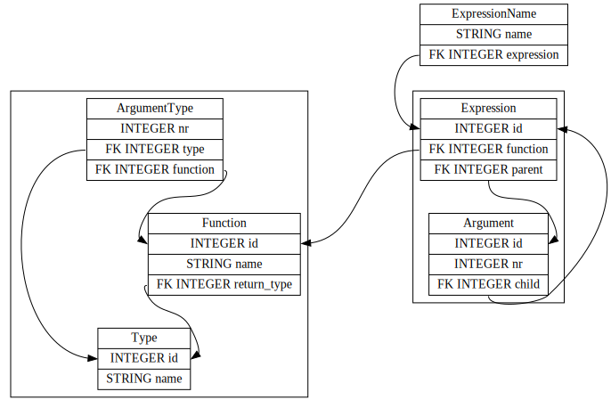

OSP

#Sissejuhatus

Minule teadaolevalt on OSP-iga hiljaks jäämisel järgmised põhjused:

* üldine sallimatus nn "enterprise" või "business" tarkvara ja amoraalsete ärivõtete vastu,
* pessimistlik maailmavaade,
* otsustusvõime puudumine,
* diskreetse matemaatika ja eesti keele meeldivus,
* laiskus.

Järgnevalt selgitan neid põhjuseid pikemalt. See on kõigest minupoolne virisemine ja selle lugemine pole seega nõutav.

## Amoraalsus ja pessimism

Paljud andmebaasi võimalikud kasutuskohad ja -viisid on minu arvates amoraalsed:

* Andmebaasi kasutamine omaalgatuslikult inimeste järele nuhkimiseks.
* Andmebaasi kasutamine "1984"-s kirjeldatule sarnanevate olukordade tekitamiseks. PRISM, Hiina kodanikupunktid, näotuvastuse ja mobiilijälituse kuritarvitamine jne.
* Andmebaasi kasutamine potensiaalsete kurjategijate profileerimiseks. Leiduvad nn "false positives" ja "false negatives".
* Andmebaasi kasutamine klientide profileerimiseks ja selle põhjal reklaami saatmine või teenusepakkumiste tegemine. Minu peal näiteks reklaam ei mõju, küll on ta aga vaimselt kurnav. Teenusepakkumised võiksid aga kõigile võrdselt kättesaadavad olla. Selle viimase vastu eksib näiteks Telia.
* Andmebaasi kasutamine püsiklientidele soodustuse pakkumiseks. Kõikidel võiks sama hind olla. Püsiklientide hoidmiseks saab kasutada ka teisi meetodeid (näiteks hea toode või teenus) peale tavaklientidele kõrgema hinna kehtestamise.
* Andmebaasi kasutamine kliendile kahjuliku teenuse osutamiseks. Näiteks kasiinod, sõltuvuse tekitamise eesmärgiga disainitud mobiilimängud, spordikihlveod jne.
* Andmebaasi kasutamine nii, et see suurendab masinlike tööülesannetega lihttööjõu vajadust. Siia alla käivad näiteks suured kaubandusketid. Kui pood on väikeettevõte, siis on müüjad üldjuhul oma toodete alal asjatundjad ning nende töö on mitmekesine ja rahuldustpakkuv. Suurtes kaubanduskettides tulevad käsud ja toodete tellimused ülevalt poolt ning kasutatakse palju madalapalgalist lihttööjõudu. Lihttööjõul on võrreldes väikepoega vähem arenguvõimalusi. Suurtes kettides otsene tagasiside toodete tellja ja kliendi vahel tihti puudub.
* Andmebaasi kasutamine nii, et selle lõppkasutajad peavad oma töökohal pidevalt andmebaasiga võitlema. Tekkib nn fustratsioon.
* Andmebaasi kasutamine nii, et see suurendab paberitööd.
* Andmebaasi kasutamine nii, et see laseb bürokraatial kasvada. Mitmed tänapäevased firmad ja asutused ei oleks ilma andmebaaside abita nii suureks kasvada saanud, kuna paberimajandus oleks suurusele piiri seadnud. Suured bürokraatiad on ebaeffektiivsed ja nendes töötamine pakub rahuldust vaid karjäristidele ja lammastele.
* Andmebaasi kasutamine töötajate produktiivsuse pidevaks kontrollimiseks ja selle põhjal inimeste vallandamine ja muude meetmete rakendamine. Produktiivsuse automatiseeritud hindamine ei arvesta tihti töö kvaliteediga ning töötajate isikliku eluga.
* Andmebaasi kasutamine nii, et arvuti annab inimesele käske. Tekkib filosoofiline küsimus, et kellel on arenenum mõistus?
* Andmebaasi kasutamine, siis kui selle järele puudub tegelik vajadus. Põhjuseks võib olla korruptsioon või andmebaasi tellja rumalus.
* Andmete müümine nn äripartneritele, kes võivad neid edasi müüa või üks kõik millisel eelneval viisil kuritarvitada. See võimaldab muuhulgas olukorra, kus ühel firmal õnnestub erinevatelt müüjatelt ostetud andmete kokkupanemisel  rohkem nuhkida või muul viisil kahju teha.
* Andmete hoidmine nii, et potensiaalne häkker või võimu esindaja võib neid üks kõik millisel eelneval viisil kuritarvitada.

Olgu, kuritarvitamisena lähevad arvesse ainult ohtlikud asjad. Kui häkker otsustab andmebaasi tabelid välja trükkida ja siis nendega mingit paberimajandust ajama hakata, siis palun väga.

Niisiis olen näidanud, et minu kriteeriumide järgi on iga andmebaas amoraalne. Peaaegu iga. Võtame ette näiteks moodles välja pakutud näidisteemad.

1. Haigla. See on ilmselt tehtud hea tahtega, aga ma juba kujutan ette, kuidas arstid seda kiruda võivad, kui midagi halvasti on. Aga üldiselt hea teema, kuigi minule võõras.
2. Uisulaenutus. Seal pole andmebaasi vaja. Isegi arvuti on vajalik vaid selleks, et uiskude vabanemisaega ennustada ja püsikliente meeles pidada (viimane on amoraalne). Kõik andmed mahuvad tööpäeva kestel arvuti mällu. Tulu saab tekstafaili logida. Päriselt ükski uisulaenutus ei kasuta andmebaasi.
3. Kino. Minu arvates näidatakse tänapäeval kinodes suhteliselt palju halbu filme ning vaatajate arvu järgi näidatavate filmide optimiseerimine viib veel suurema allakäiguni.
4. Kondiitriäri. Selline nädalase ettetellimisajaga ja mitmete poodidega kett pakub tõelist kõrgklassi teenust ning sellele Eestis piisavalt turgu ei leidu, et tasuks teha andmebaas.
5. Kaardikollektsioonid. Kui edu mängus oleneb sellest, kui palju raha mängja kaartide ostmisele kulutab, siis on see amoraalne. Minu teada on see valdkond, kus lastele tehakse ajupesu ja liiga lahked vanemad maksavad selle kinni.
6. Koolitusfirma. Kui on kaks maja siis võiks teha kaks firmat. Eesti riik on süüdi selles, et firmade juurde tegemine ei ole nn "zero cost abstraction". Mõlemas firmas töötaks kolm inimest. Kaks valvurit kes käivad kordamööda tööl ja hoiavad enda ruumis suuri kaustikuid ja võtmeid. Ning üks direktor/raamatupidaja/koolitajate otsja/reklaamia. Kui kaustikud õigesti teha, siis on kõik piisavalt kiire.
7. Autorendifirma. Niikaua kuni rentimine ja tagastamine toimuvad samas kohas piisab suurtest kaustikutest kui need on õigesti disainitud. Kaustikud on lollikindlamad kui andmebaasid. Veebibroneerimine pole vajalik. Kasutage telefoni.
8. Tööhõive arvestus. Ma olen veendunud, et firma töötajad ise teavad, mille peale ebamõistlikult palju aega kulub ja kes kui hästi töötab. Ülemused võiksid oma töötajaid kuulata, mitte nõuda neilt tööaja kasutuse arvutisse sisestamist.
9. Muusikakauplus. Ma tsiteerin "Firmal on mitu taset "sõbrakaarte"" ja oigan vaikselt seda kirjutades. Kui töötajad tahavad kangesti oma sõpradele allahindlust teha, siis võivad nad ju lihtsalt seda salaja teha.
10. Raamatukogu. Elagu hea teema. Paraku on enamus raamatukogusid sarnased ja kogu vajalik tarkvara on ilmselt turul saada.

## Valed valikuvõimalused

Enne raamatukogu teema valimist kaalusin teisi variante. Järgnevalt põhjendan, miks pidin need välja praakima.

* Andmebaas, mis hoiab lausearvutuse valemite peal kehtivaid samaväärsusi ja mida ma praktikumis tutvustasin. See on halb mõte, kuna:
  * Andmebaassisaldaks puid ja tsükleid, mida oleks parem kujutada OOP või mingi muu andmebaasiga. Relatsioonilise andmebaasi kasutamine on selle teema puhul ebamugav.
  * Meile ei õpetatud, kas ja kuidas teha SQL-is rekursiivseid päringuid. Ma lugesin internetist midagi WITH võtmesõna kohta, aga ei saanud aru. (Oleks kasu olnud, kui meid oleks SAP-i interaktiivse SQL-i kasutusjuhendisse suunatud.)
  * See andmebaas tuleks nii väike (minu hinnangul alla saja kilobaidi), et targem oleks kasutada tekstifaili. 
  * Nii et kokkuvõttes oleks tegu, diskreetse matemaatika, andmetüübiteoria ja relatsioonilise andmebaasiteooria alase enesepiinamisülesandega.
* Andmebaas, mis hoiaks koolimatemaatika termineid, nende õpetamise aegu ja nende vahelisi sõltuvusi suunatud graafina. Selle mõtte mõtles välja üks sugulasest Tallinna Ülikooli õppejõud. Mõte tuli välja praakida, kuna seal oleks vaid üks tabel ja andmebaasi asemel saaks kasutada Püütonit ja tekstifaile.
* Andmebaas, mis hoiaks LEGO tükkide infot. Paraku olin oma LEGO-d ära andnud.
* Andmebaas erinevate autorite ja teoste sõnakasutuse statistiliseks võrdluseks. Kasutaksin vikitekste, et leida materjali ja estnltk-d et leida iga sõna algvorm. See on halb mõte, kuna:
  * SQL ei ole statistika ja teadusarvutuse tööriist.
  * Tabeleid tuleks liiga vähe.
  * Ühel sõnal võib olla mitu eri algvormi.
  * Andmebaasi indeksid võivad andmemahtu kettal ette ennustamatult suurendada.
* Andmebaas varukoopiate hoidmiseks. Kui midagi sellist ise kirjutada, siis on selle katki minemise tõenäosus liiga suur. Samuti kui teha diferentsiaalseid varukoopiaid, siis võib graafe tarvis minna.
* Pilaprojekti andmebaas, kus on sellised tabelite nimed ja väljade väärtused nagu: "Teleekraan", "Wilson", "armastuse ministeerium" ja "Suur Vend".

Lisaks pidin valima vahendi diagrammide tegemiseks. Mul on villand minu arvutis olevast halvast tarkvarast ja seepõrast hakkasin ise joonistusvahendit otsima. Minu valikud olid järgmised:

1. Graphviz. Ei sobinud, kuna kirjelduskeel oli liiga keeruline ja diagrammid tulid koledad.

   

2. Valisin lõpuks QuickDBD. Ta on küll bugine ja temaga esaab tasuta teha vaid kuni 10 tabelit.

# Raamatukogu andmebaasi kirjeldus

* Märksõnad
* Osakonnad
* Töötajate kasutajad
* Seisukorra täpsem hindamine
* Aadressid
* Kohaviitade süsteem
* Lugejakaardi numbrite süsteem
* Kirjastused
