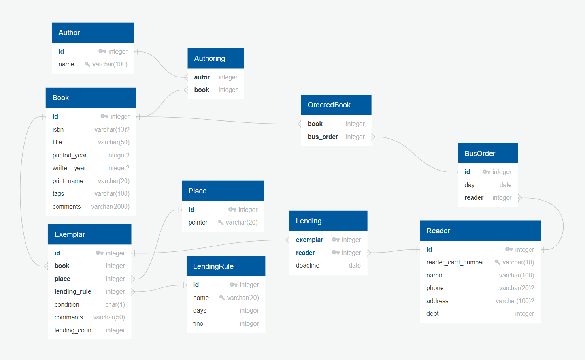

# Oma suur projekt.

See on andmebaaside kursuse jaoks tehtud raamatukogu näidisprojekt.

Kasutatud tarkvara:
 * SAP SQL anywhere
 * QuickDBD
 * Windowsi käsurida

## Failide sisu:

* [OSP.md](OSP.md) .Selles failis on pikk kirjeldus, miks see projekt nii hiljaks jäi ja natukene infot raamatukogu koha. Info raamatukogu kohta on puudulik.

* [project.sql](project.sql). Selles failis on projekti andmebaasi genereerimise kood ja näidisandmete lugemine.

* [delete_and_init_db.cmd](delete_and_init_db.cmd). Kustutab andmebaasi ja genereerib selle uuesti.

* [QuickDBD_input.txt](QuickDBD_input.txt). Tekst, mis tuleb kopeerida QuickDBD aknasse, et saada diagramm.
  NB: QuickDBD ei mäleta, mis kastid kus paiknevad ja need tuleb ise paika lohistada.

* [mysql_export.sql](mysql_export.sql). QuickDBD genereeritud väljund.

* [diagramm.PNG](diagramm.PNG). QuickDBD-ga genereeritud diagramm.

  

* [F.md](F.md). Relatsioonide funktsionaalsete sõltuvuste analüüs. See pole veel üldsegi valmis.

## Muud märkused

QuickDBD_input.txt, diagramm.PNG ja mysql_export.sql on ajast maas.
Ma tegin project SQL-is mõned muudatused, mis ei ole QuickDBD failides ja diagrammis näha,
kuigi nad võiks olla. Nimelt on Lending - Exemplar  "üks või null ühele" seos.
ja seda pole diagrammis ja QuickDBD failides näha. Samuti võivad mõned andmetüübid valed olla.
